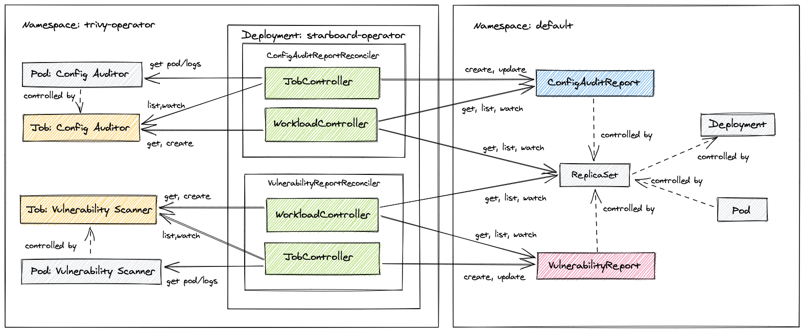

Vul has a native [Kubernetes Operator](operator) which continuously scans your Kubernetes cluster for security issues, and generates security reports as Kubernetes [Custom Resources](crd). It does it by watching Kubernetes for state changes and automatically triggering scans in response to changes, for example initiating a vulnerability scan when a new Pod is created.

> Vul Operator is based on existing Khulnasoft OSS project - [Starboard], and shares some of the design, principles and code with it. Existing content that relates to Starboard Operator might also be relevant for Vul Operator. To learn more about the transition from Starboard to Vul, see the [announcement discussion](https://github.com/khulnasoft-lab/starboard/discussions/1173).

<figure>
  
  <figcaption>Workload reconcilers discover K8s controllers, manage scan jobs, and create VulnerabilityReport and ConfigAuditReport objects.</figcaption>
</figure>
