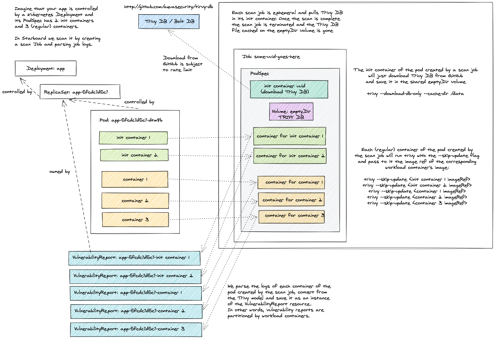
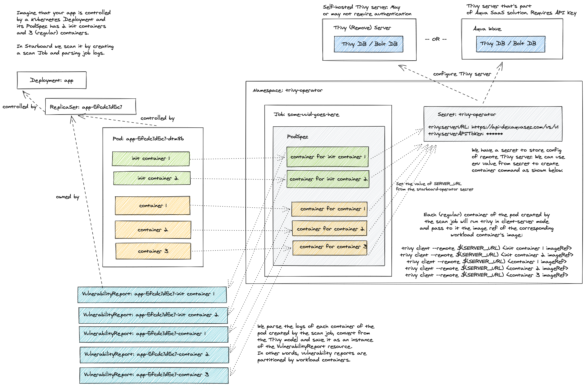

# Vul Scanner

## Standalone

The default configuration settings enable Vul `vulnerabilityReports.scanner` in [`Standalone`][vul-standalone]
`vul.mode`. Even though it doesn't require any additional setup, it's the least efficient method. Each Pod created
by a scan Job has the init container that downloads the Vul vulnerabilities database from the GitHub releases page
and stores it in the local file system of the [emptyDir volume]. This volume is then shared with containers that perform
the actual scanning. Finally, the Pod is deleted along with the emptyDir volume.



The number of containers defined by a scan Job equals the number of containers defined by the scanned Kubernetes
workload, so the cache in this mode is useful only if the workload defines multiple containers.

Beyond that, frequent downloads from GitHub might lead to a [rate limiting] problem. The limits are imposed by GitHub on
all anonymous requests originating from a given IP. To mitigate such problems you can add the `vul.githubToken` key to
the `starboard` secret.

```
GITHUB_TOKEN=<your token>

kubectl patch secret starboard-vul-config -n <starboard_namespace> \
  --type merge \
  -p "$(cat <<EOF
{
  "data": {
    "vul.githubToken": "$(echo -n $GITHUB_TOKEN | base64)"
  }
}
EOF
)"
```

## ClientServer

You can connect Starboard to an external Vul server by changing the default `vul.mode` from
[`Standalone`][vul-standalone] to [`ClientServer`][vul-clientserver] and specifying `vul.serverURL`.

```
VUL_SERVER_URL=<your server URL>

kubectl patch cm starboard-vul-config -n <starboard_namespace> \
  --type merge \
  -p "$(cat <<EOF
{
  "data": {
    "vul.mode":      "ClientServer",
    "vul.serverURL": "$VUL_SERVER_URL"
  }
}
EOF
)"
```

The Vul server could be your own deployment, or it could be an external service. See Vul documentation for more
information on deploying [Vul server][vul-clientserver].

If the server requires access token and / or custom HTTP authentication headers, you may add `vul.serverToken`
and `vul.serverCustomHeaders` properties to the `starboard` secret.

```
SERVER_TOKEN=<your server token>
X_API_TOKEN=<your API token>

kubectl patch secret starboard-vul-config -n <starboard_namespace> \
  --type merge \
  -p "$(cat <<EOF
{
  "data": {
    "vul.serverToken":         "$(echo -n $SERVER_TOKEN | base64)",
    "vul.serverCustomHeaders": "$(echo -n x-api-token:$X_API_TOKEN | base64)"
  }
}
EOF
)"
```



## Settings

| CONFIGMAP KEY                      | DEFAULT                            | DESCRIPTION                                                                                                                                                         |
|------------------------------------|------------------------------------|---------------------------------------------------------------------------------------------------------------------------------------------------------------------|
| `vul.imageRef`                   | `docker.io/khulnasoft/vul:0.25.2`   | Vul image reference                                                                                                                                               |
| `vul.dbRepository`               | `ghcr.io/khulnasoftskhulnasoft-labecurity/vul-db`    | External OCI Registry to download the vulnerability database                                                                                                                                               |
| `vul.mode`                       | `Standalone`                       | Vul client mode. Either `Standalone` or `ClientServer`. Depending on the active mode other settings might be applicable or required.                              |
| `vul.severity`                   | `UNKNOWN,LOW,MEDIUM,HIGH,CRITICAL` | A comma separated list of severity levels reported by Vul                                                                                                         |
| `vul.ignoreUnfixed`              | N/A                                | Whether to show only fixed vulnerabilities in vulnerabilities reported by Vul. Set to `"true"` to enable it.                                                      |
| `vul.skipFiles`                  | N/A                                | A comma separated list of file paths for Vul to skip traversal.                                                                                                   |
| `vul.skipDirs`                   | N/A                                | A comma separated list of directories for Vul to skip traversal.                                                                                                  |
| `vul.ignoreFile`                 | N/A                                | It specifies the `.vulignore` file which contains a list of vulnerability IDs to be ignored from vulnerabilities reported by Vul.                               |
| `vul.timeout`                    | `5m0s`                             | The duration to wait for scan completion                                                                                                                            |
| `vul.serverURL`                  | N/A                                | The endpoint URL of the Vul server. Required in `ClientServer` mode.                                                                                              |
| `vul.serverTokenHeader`          | `Vul-Token`                      | The name of the HTTP header to send the authentication token to Vul server. Only application in `ClientServer` mode when `vul.serverToken` is specified.        |
| `vul.serverInsecure`             | N/A                                | The Flag to enable insecure connection to the Vul server.                                                                                                         |
| `vul.insecureRegistry.<id>`      | N/A                                | The registry to which insecure connections are allowed. There can be multiple registries with different registry `<id>`.                                            |
| `vul.nonSslRegistry.<id>`        | N/A                                | A registry without SSL. There can be multiple registries with different registry `<id>`.                                                                            |
| `vul.registry.mirror.<registry>` | N/A                                | Mirror for the registry `<registry>`, e.g. `vul.registry.mirror.index.docker.io: mirror.io` would use `mirror.io` to get images originated from `index.docker.io` |
| `vul.httpProxy`                  | N/A                                | The HTTP proxy used by Vul to download the vulnerabilities database from GitHub.                                                                                  |
| `vul.httpsProxy`                 | N/A                                | The HTTPS proxy used by Vul to download the vulnerabilities database from GitHub.                                                                                 |
| `vul.noProxy`                    | N/A                                | A comma separated list of IPs and domain names that are not subject to proxy settings.                                                                              |
| `vul.resources.requests.cpu`     | `100m`                             | The minimum amount of CPU required to run Vul scanner pod.                                                                                                        |
| `vul.resources.requests.memory`  | `100M`                             | The minimum amount of memory required to run Vul scanner pod.                                                                                                     |
| `vul.resources.limits.cpu`       | `500m`                             | The maximum amount of CPU allowed to run Vul scanner pod.                                                                                                         |
| `vul.resources.limits.memory`    | `500M`                             | The maximum amount of memory allowed to run Vul scanner pod.                                                                                                      |

| SECRET KEY                  | DESCRIPTION                                                                                                                       |
|-----------------------------|-----------------------------------------------------------------------------------------------------------------------------------|
| `vul.githubToken`         | The GitHub access token used by Vul to download the vulnerabilities database from GitHub. Only applicable in `Standalone` mode. |
| `vul.serverToken`         | The token to authenticate Vul client with Vul server. Only applicable in `ClientServer` mode.                                 |
| `vul.serverCustomHeaders` | A comma separated list of custom HTTP headers sent by Vul client to Vul server. Only applicable in `ClientServer` mode.       |

[vul-standalone]: https://khulnasoft-lab.github.io/vul/latest/modes/standalone/
[emptyDir volume]: https://kubernetes.io/docs/concepts/storage/volumes/#emptydir
[rate limiting]: https://docs.github.com/en/free-pro-team@latest/rest/overview/resources-in-the-rest-api#rate-limiting
[vul-clientserver]: https://khulnasoft-lab.github.io/vul/latest/advanced/modes/client-server/
